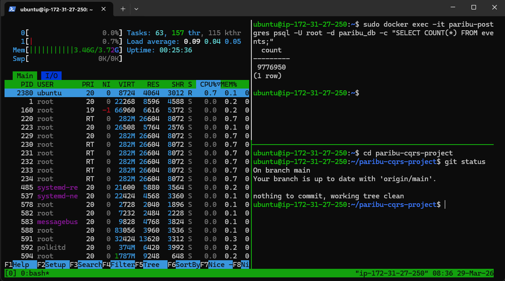

# 🚀 High-Performance Event-Driven E-Commerce Engine | CQRS, Event Sourcing & Chaos Engineering

Bu proje, yüksek trafikli e-ticaret (veya finansal) sistemlerin devasa anlık yükleri çökmeden nasıl yönetebileceğini göstermek amacıyla "Go (Golang)" kullanılarak geliştirilmiş dağıtık bir sipariş yönetim sistemidir. 

Monolitik ve geleneksel CRUD mimarilerinin yetersiz kaldığı durumlar simüle edilmiş; "CQRS (Command Query Responsibility Segregation)" ve "Event Sourcing" prensipleriyle sistemin yazma ve okuma yükleri fiziksel olarak birbirinden ayrılmıştır.
Ek olarak sisteme Kaos Mühendisliği (Chaos Engineering) prensipleri uygulanmış; veritabanı çökmelerine, DDoS saldırılarına ve eşzamanlı tek ürün krizlerine karşı özel savunma algoritmaları (Circuit Breaker, Rate Limiter, Hybrid Fast Reject) entegre edilmiştir.

## 🏗️ Mimari Tasarım ve İşleyiş

Sistem, geleneksel "Veritabanına yaz ve eski veriyi sil" mantığı yerine bankacılık ve borsa altyapılarında kullanılan "Event Sourcing" (Olay Kaynağı) mantığıyla çalışır. Her işlem (Örn: Sipariş Oluşturuldu) bir "Olay" (Event) olarak `events` tablosuna kaydedilir ve asla silinmez.

Sistem iki ana parçaya (CQRS) bölünmüştür:

1. Command (Yazma) Kapısı (POST /reserve ve POST /payment): Dışarıdan gelen rezervasyon ve ödeme isteklerini karşılar. İşlemler doğrudan kuyruğa gönderilmez; veri kaybını (%100 Zero-data-loss) önlemek amacıyla Outbox Pattern kullanılır. Olay (Event) önce PostgreSQL'deki Outbox tablosuna yazılır, ardından arka plandaki bir Relay Worker (Postacı) tarafından Redpanda mesaj kuyruğuna (Produce) fırlatılır.
2. Query (Okuma) Kapısı (Projections): Sistemin okuma tarafında 7/24 Redpanda'yı dinleyen 3 farklı "İşçi" (Consumer/Projection) bulunur. Bu işçiler `order-events` topic'inden gelen olayları duydukları an, son kullanıcıların veya yöneticilerin hızlıca okuyabilmesi için tertemiz "Query" tablolarını güncellerler (Eventual Consistency).

### 🛠️ Projection (İşçi) Servisleri
* Order Summary Projection: Olayı duyduğunda `order_summaries` tablosunu günceller. Kullanıcıların "Siparişlerim" ekranını milisaniyeler içinde yüklemesini sağlar.
* Inventory Projection: Satılan ürünün stoğunu `products` tablosundan düşer.
* Revenue Projection (Kasa): Günlük ciro hesaplamalarını tutar. Milyonlarca satırı toplamak yerine `daily_revenues` tablosunda günün tarihi için tek bir satır tutar. Eşzamanlılık (Race Condition) sorunlarını önlemek için PostgreSQL üzerinde Atomic Update (`total_revenue + EXCLUDED.total_revenue`) kullanılmıştır.
* Analytics Worker (Kasa ve Analiz): order-events kuyruğunu dinleyerek günlük ciro hesaplamalarını ve dönüşüm oranlarını (CR) anlık olarak işler.
* Notification Worker (Bildirim): Akıllı bekleme listesi (WaitList) ile entegre çalışır. Rezerve edilen bir ürün boşa çıktığında, sırada bekleyen müşterilere anlık push bildirimleri fırlatır.
* Email Worker (İletişim): Ödemesi başarıyla tamamlanan siparişleri dinler ve müşterilere asenkron olarak sipariş dekontlarını iletir. Ana API'nin e-posta gönderim süreleriyle meşgul olmasını engeller.

(Not: Çift kayıtları (Double Spending/Duplicate Processing) önlemek amacıyla tüm projection'larda "Idempotency" (Upsert) mantığı kurulmuştur.)

## ⚙️ Kullanılan Teknolojiler
* Backend: Go (Golang), Gin Framework, GORM
* Veritabanı (Write): PostgreSQL
* Önbellekleme (Read): Redis (Milisaniye altı okuma hızı için)
* Message Broker: Redpanda (Kafka alternatifi, yüksek hızlı event streaming)
* Resilience (Dayanıklılık): gobreaker (Circuit Breaker), rate (Token Bucket)
* Altyapı & Test: Docker, AWS EC2, Artillery (Yük Testi)

## 🛡️ FAZ 2: Zırhlandırma ve Kaos Mühendisliği (Chaos Engineering)
Donanım sınır testlerinden elde edilen veriler ışığında sistemin savunma ve performans katmanları baştan aşağı yeniden tasarlanmıştır:

* Redis Cache ile Işık Hızında Okuma: Okuma maliyetleri veritabanından alınarak Redis RAM'ine taşındı. Önbellek isabeti (Cache Hit) sağlanan isteklerde API yanıt süresi 1-2 milisaniye** bandına düşürüldü.
* Hibrit Fast Reject & Smart Sweeper (Akıllı Çöpçü): "Aynı ürünü iki kişi aynı anda almaya çalışırsa ne olur?" krizini çözmek için veritabanını kilitleyen (Deadlock yaratan) `Pessimistic Lock` yerine Hızlı Red algoritması kuruldu. İkinci kullanıcı asenkron bir `WaitList` tablosuna alınır. Akıllı çöpçü, süre dolduğunda asıl kullanıcı ürünü almadıysa sıradaki kişiye Kafka üzerinden bildirim fırlatır; sırada kimse yoksa mevcut kişinin süresini sessizce uzatır (Lazy Release).
* Circuit Breaker (Sigorta): Kasten veritabanı konteyneri kapatılarak (Kaos Testi) sistemin dayanıklılığı ölçüldü. Veritabanı çöktüğünde sistem kilitlenmek yerine sigorta attırdı (`closed -> open`) ve isteklere zarifçe `503 Service Unavailable` döndü. Veritabanı geri geldiğinde ise sistem kendi kendini otomatik onardı (Self-Healing).
* Rate Limiter (DDoS Kalkanı): Kötü niyetli saldırıları ve botları engellemek için API kapısına IP tabanlı Token Bucket algoritması yerleştirildi.

## 📊 FAZ 1: Stres Testleri, Kriz Yönetimi ve Donanım Sınır Analizi (AWS)
Projenin dayanıklılığını ölçmek için yerel ve bulut (Cloud) ortamında iki farklı stres testi gerçekleştirilmiştir. Amaç sistemi çökertmek ve donanımın kırılma noktalarını (Bottleneck) tespit etmektir.

### 1. Yerel Test (Localhost) - 1 Milyon İstek
* Kendi geliştirdiğimiz `loadtest/main.go` scripti ile sisteme localde 1.000.000 sahte sipariş fırlatılmıştır.
* Sonuç: Test ~30 dakikada başarıyla tamamlanmış ve tüm veriler Event Sourcing mimarisine uygun şekilde işlenmiştir.

▶️ **[1 Milyonluk Local Test Videosunu İzlemek İçin Tıklayın](./assets/local-video.mp4)**

### 2. Bulut Testi (AWS EC2) - Donanım Kırılma Noktası Analizi
Sistemin sınırlarını görmek için AWS üzerinde `c7i-flex.large` (4GB RAM, 30GB Disk) sunucusunda 100 Milyonluk devasa bir yük testi başlatılmıştır.

▶️ **[9.77 Milyonluk AWS Donanım Sınır Testi Videosunu İzlemek İçin Tıklayın](./assets/aws-video.mp4)**

* Karşılaşılan İlk Kriz (OOM Killer): İlk denemede milyonlarca Goroutine aynı anda açıldığı için 4GB RAM saniyeler içinde %100'e ulaşmış ve Linux çekirdeği sunucuyu korumak için OOM (Out of Memory) Killer'ı devreye sokarak süreci sonlandırmıştır.
* Mühendislik Çözümü (Worker Pool & Rate Limiting): Kod revize edilerek 150 işçiden (Worker) oluşan bir havuz kurulmuş ve `Timeout` mekanizmaları eklenmiştir. Bu sayede RAM kullanımı 2.2GB seviyesinde sabitlenmiş ve sistem stabilize edilmiştir.
* Nihai Kırılma Noktası ve Başarı: Revize edilen sistem AWS üzerinde 12 saat boyunca %100 CPU yüküyle çalıştırılmıştır. Sistem 9.776.950 siparişi başarıyla işledikten sonra, makinenin I/O (Disk Okuma/Yazma) ve depolama limitlerine çarparak çekirdek kilitlenmesi (Kernel Freeze) yaşamıştır.
* Graceful Degradation (Zarif Yavaşlama): Sunucu kilitlenmeden hemen önce anında çökmek yerine, veritabanı bağlantı havuzunun dolması sebebiyle `SLOW SQL >= 200ms` uyarıları vererek bazı istekleri zaman aşımına uğratmış (Timeout) ve sistemin kontrollü bir şekilde yavaşladığını kanıtlamıştır. Makine yeniden başlatıldığında, CQRS ve Event Sourcing mimarisinin doğası gereği kaydedilen 9.77 Milyon verinin diskte sapasağlam durduğu gözlemlenmiştir.

## 📊 Performans ve Kıyaslama Özeti

Projeyi test etmek için hem yerel donanım hem de bulut sunucusu üzerinde iki farklı stres testi uygulanmış ve metrikler kayıt altına alınmıştır:

💻 Yerel Ortam (Localhost)
- Test Hacmi: 1.000.000 Sipariş
- İşlem Süresi: ~30 Dakika (1836.27 saniye)
- Ortalama Hız (TPS): 544 sipariş/saniye
- Durum: %100 Başarı ile tamamlandı, donanım sınırı aşılmadı.

☁️ Bulut Ortamı (AWS c7i-flex.large - 4GB RAM)
- İşlenen Toplam Event: 9.776.950 Sipariş (Başarıyla diske yazıldı)
- Kesintisiz Çalışma Süresi: 12 Saat (Donanımın fiziksel Disk/IO sınırına çarpana kadar)
- RAM Kullanımı: ~2.2 GB (Worker Pool optimizasyonu ile sınırlandırıldı)
- Hız (TPS): ~360 sipariş/sn (Veritabanı yorulması sonrası stabilize hız) | Zirve (Peak): 1100+ sipariş/sn

## 🔮 Gelecek Planları (Roadmap)
Sistemin temel omurgası tamamlanmış olup, ilerleyen fazlarda eklenecek mimari geliştirmeler şunlardır:
* JWT (JSON Web Token) Kimlik Doğrulaması: Uçtan uca güvenli kullanıcı yetkilendirme altyapısı.
* Distributed Redis Cluster: Projenin yatayda 10'dan fazla sunucuya (node) dağıtılması durumunda state (durum) senkronizasyonunu kusursuz yönetecek merkezi Redis kümesi entegrasyonu.
* Tüm sistemin çalışabileceği bir arayüz tasarımı.

## 🚀 Kurulum ve Çalıştırma

1. Projeyi klonlayın ve klasöre girin:

   git clone <repo-url>
   cd paribu-cqrs-project

2. Docker Compose ile PostgreSQL ve Redpanda'yı ayağa kaldırın:

   docker-compose up -d

3. Redpanda üzerinde gerekli topic'i oluşturun:

   docker-compose exec redpanda rpk topic create order-events

4. Ana API'yi (Command) ve İşçileri (Projections) ayrı terminallerde çalıştırın:

  * go run main.go
  * go run projections/summary/main.go 
  * go run projections/inventory/main.go
  * go run projections/revenue/main.go
  * go run analytics_worker.go
  * go run notification_worker.go
  * go run notification_worker.go
